# Welcome to DevPilot: Your pair programming partner makes you a greater navigator

[English](README.md) | [中文](README_ZH.md)

## Take a Glimpse

Unleash the power of AI in your coding with DevPilot, your new coding buddy, designed exclusively for IntelliJ IDEA.

This innovative AI-based plugin is set to supercharge your development process.

## Stellar Features

1. **Intelligent Code Suggestions:** Say goodbye to coding roadblocks! DevPilot dishes out real-time code suggestions as you type, understanding your context and serving up precise recommendations.
2. **Proactive Bug Detection:** Keep bugs at bay! DevPilot spots potential bugs and errors before they become a problem, offering smart solutions and alternatives for efficient, error-free code.
3. **Code Refactoring:** Level up your code! DevPilot helps optimize your code, providing  insights on how to refactor and boost your code's structure and performance.
4. **Unit Test Generation:** Testing made easy! DevPilot can generate unit testing code for you, making sure your code not only works as expected but is also ready for any future changes.
5. **Code Explanation:** Don't just write code, understand it! DevPilot can explain unfamiliar code snippets, helping you grasp what's happening and learn faster.
6. **Auto-Comments:** Keep your code clear! DevPilot can automatically add comments to your code, ensuring it's easy to understand and maintain.

## Prerequisites

1. You will need an OpenAI API key / Codellama API endpoint before you use this plugin.
2. For use of Codellama, see [deploy Codellama into you local environment](https://github.com/openpilot-hub/codellama-deploy).

## Installation

Currently, the plugin has version requirements for IntelliJ IDEA. The minimum required version is 2021.2, make sure you have the appropriate version installed before attempting to use the plugin.

There are three ways for installing plugins:

- IDEA official marketplace - You can get the plugin from [here](https://plugins.jetbrains.com/plugin/23322-devpilot).

- Installation via compressed package - select "install from disk" in the plugin page settings, and then import the zip package. The download link for the compressed package is available in [Release page](https://github.com/openpilot-hub/devpilot-intellij/releases).
  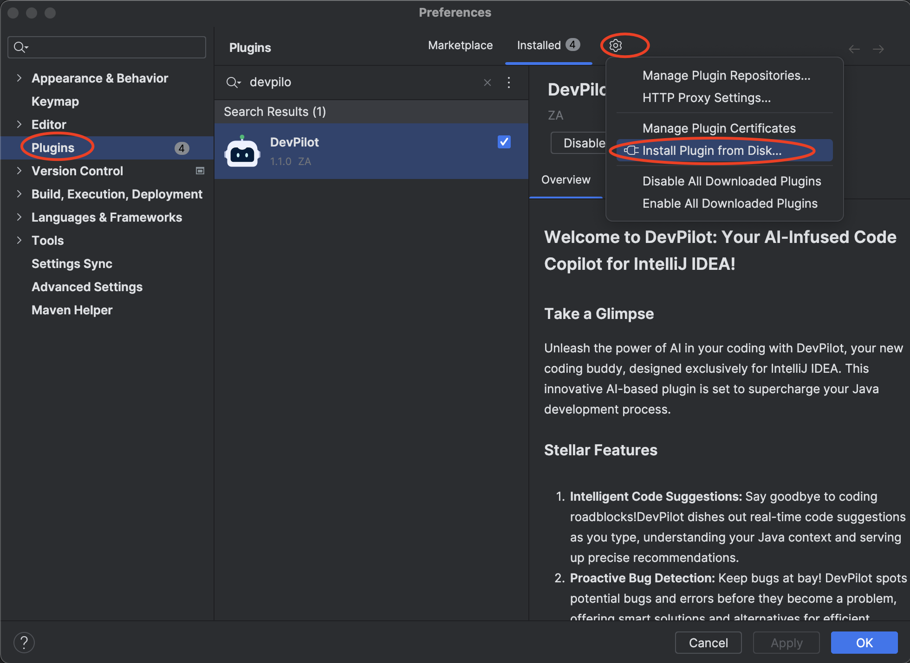
- Build from scratch
  1. Clone this repository to your local machine.
     `git clone https://github.com/openpilot-hub/devpilot-intellij.git`
  2. Run the following command to build the project.
  
     `./gradlew runIde`
  
     If you are using windows, run the following command to build the project.
  
     `gradlew.bat runIde`

## Configuration

After the successful installation of the plugin, you can find the configuration page of DevPilot in the Tools section of the IDEA settings page.
open the settings with <kbd>command</kbd>+<kbd>,</kbd>,

then navigate to Tools ❯ DevPilot ❯ Service Configuration.

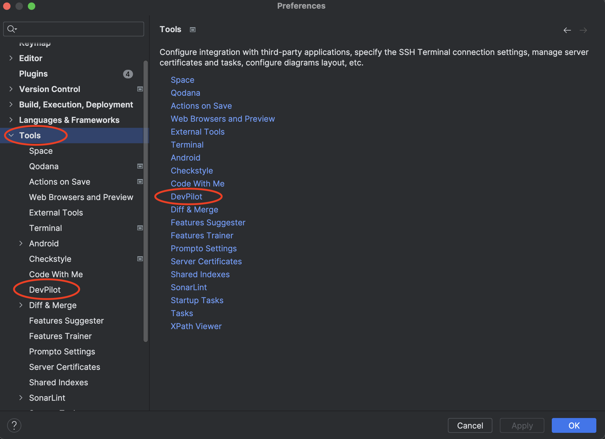

On the configuration page, you can switch the language of the plugin between multiple choices, as well as select different models and their addresses. The username will be displayed on the page during the conversation.  
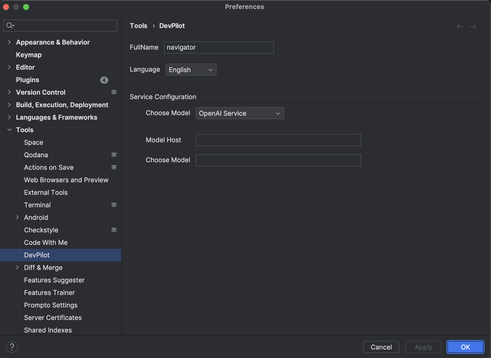

## How to use

In the dialog box, you can ask any question and send it by pressing Enter or using the send button. DevPilot will then provide an answer and display it on the current page.

Select a block of code, then right-click on the "DevPilot" option on the context menu.You can choose from one of:

- New DevPilot Chat
- Generate Tests
- Review Code
- Generate Comments
- Fix This
- Performance Check
- Explain This

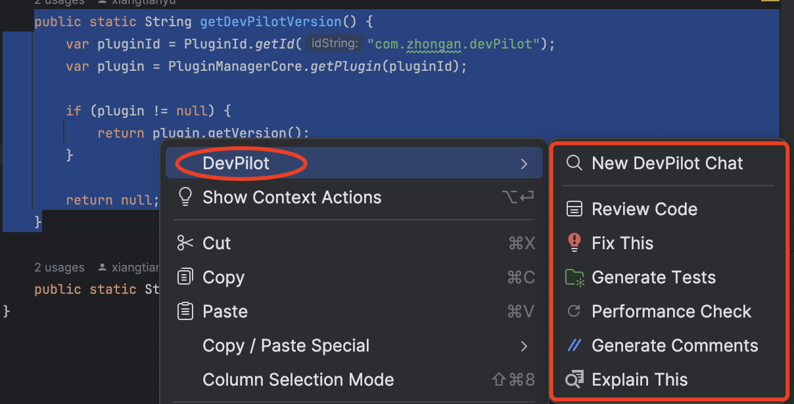

**For example**, select the code, right-click ❯ DevPilot ❯ Fix This.

Then, the window will automatically open and provide relevant suggestions for fixes. You can modify the code based on the suggestions.

## Plugin Functionality

DevPilot provides developers with rich capabilities to help them eliminate the tedious work of writing test cases and comments, write more efficient code, and troubleshoot code issues, among other things.

### Chat with DevPilot

The plugin supports chat, the conversation page can be opened through the right-click menu or the entry on the right sidebar.

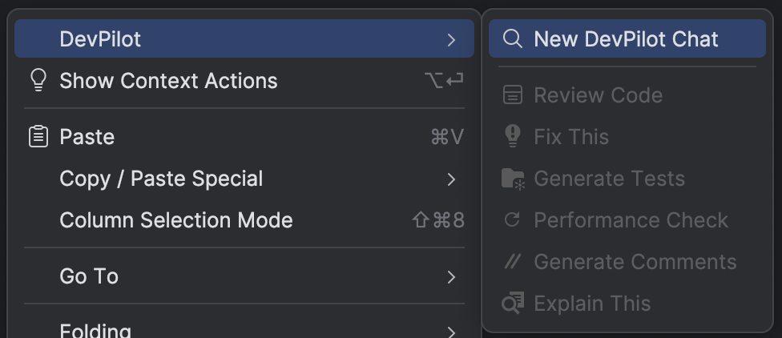

You can write questions in the dialogue box, send them by pressing enter or the send button, and OpenAI will provide answers and display them on the current page.

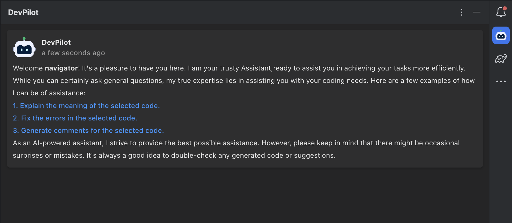

### Generate test cases

Users can generate test cases through our plugin. Users can right-click on a selected method and click "Generate Tests".

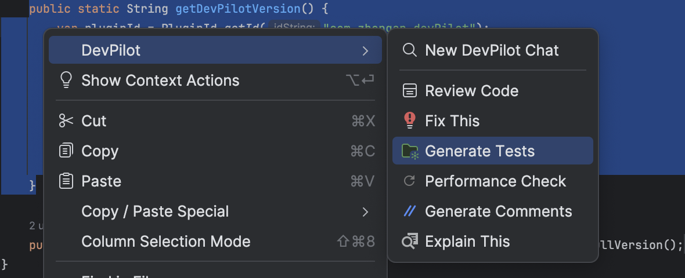

Afterward, a window will automatically open and the window will return the relevant test cases. Users can directly copy the test or choose to insert or replace the relevant code at the cursor position. They can even create a new test class file.

### Generate comments

Plugin supports the function of generating code comments. Users can right-click and select "Generate comments" after selecting a code block.

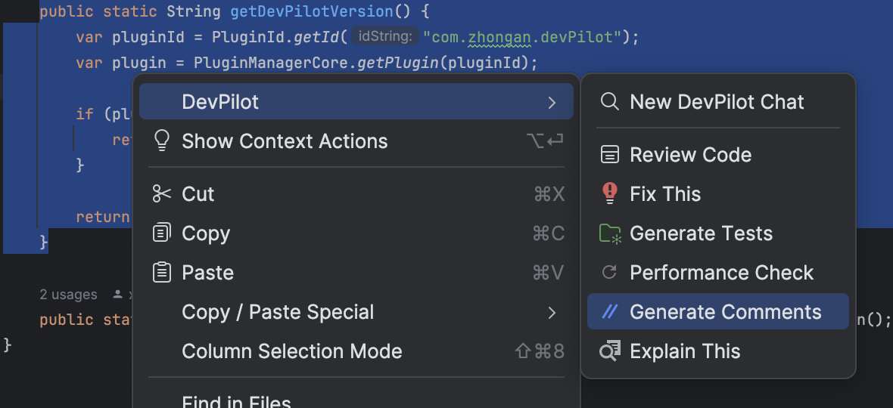

Afterward, the window will automatically open and return the relevant annotation results. The edited code will also automatically show the generated annotations and the original code in a diff format, allowing users to compare and accept the corresponding annotations.

### Fix bugs

The plugin supports the ability to fix code. Users can right-click on "Fix This" after selecting a code block.

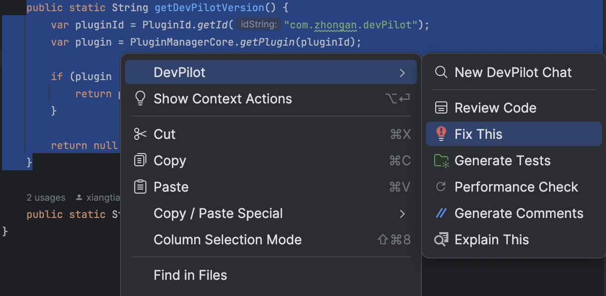

Afterward, the window will automatically open and provide relevant repair suggestions. Users can modify their code based on the suggestions.

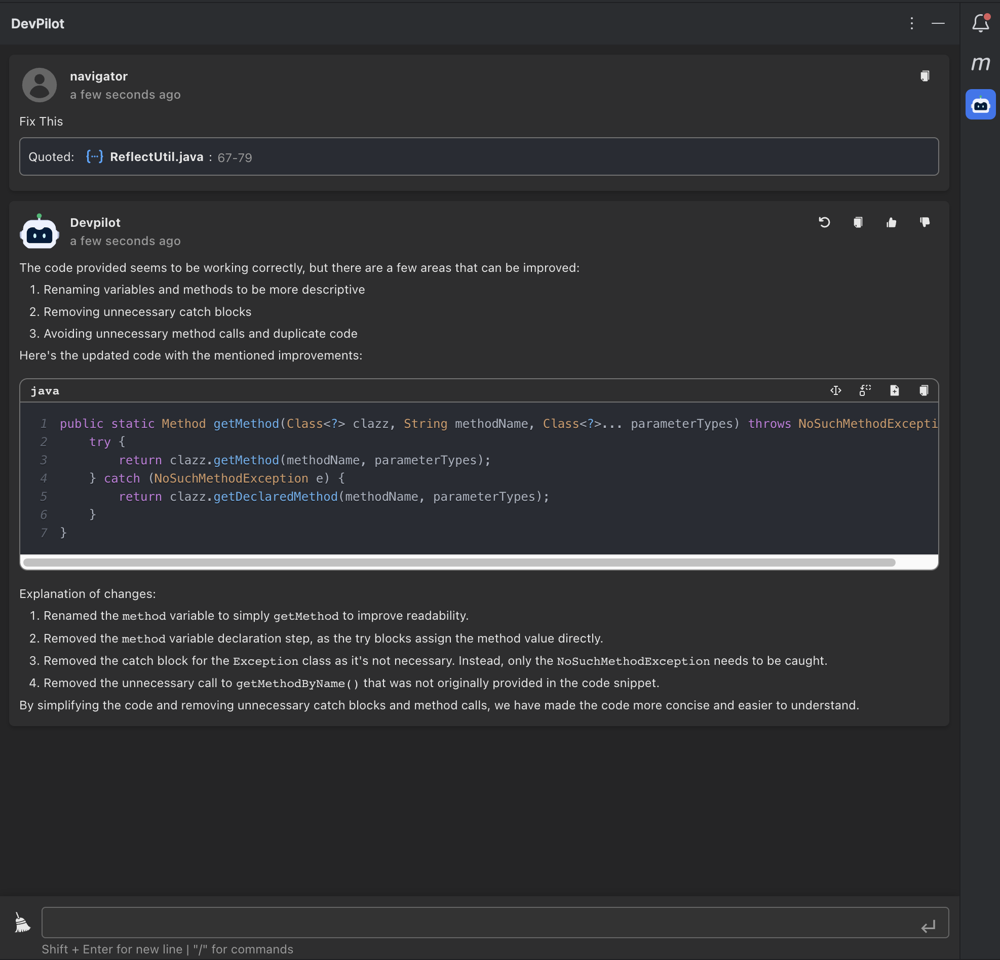

### Review code

The plugin supports the ability to review code. Users can right-click on the selected code block and click "Review Code".

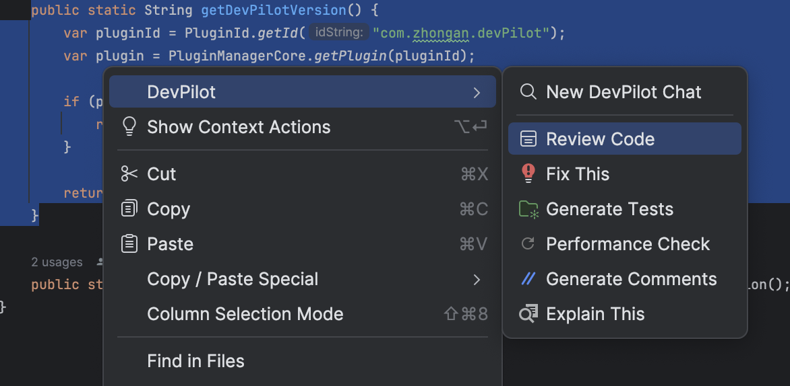

Afterward, the window will automatically open and return the relevant review results. Users can edit their code logic based on the results.

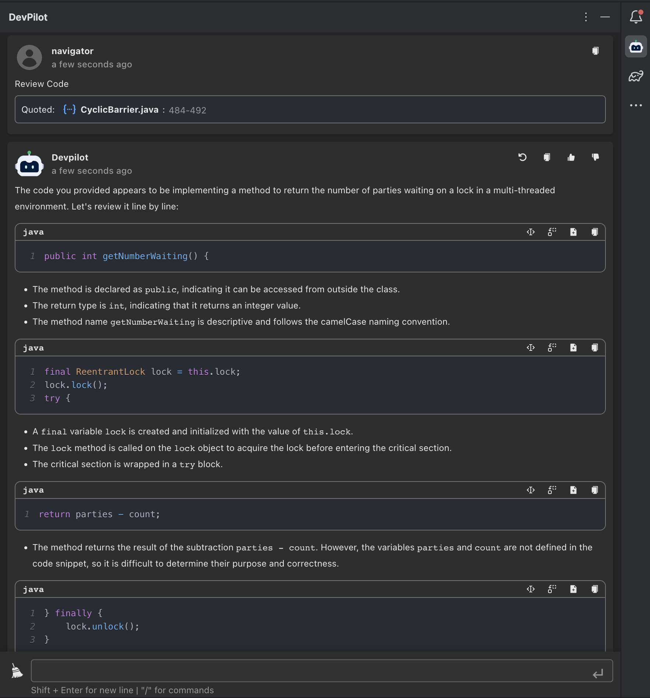

### Performance Check

The plugin supports performance checking of code. Users can right-click on the selected code block and choose "Performance Check".

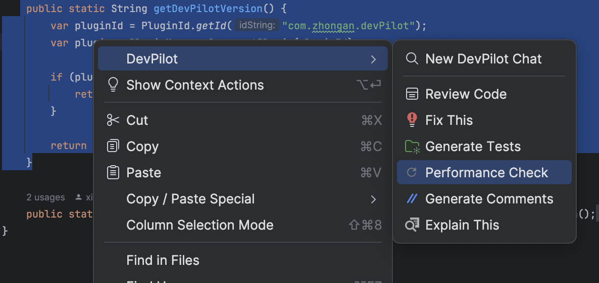

Afterward, the window will automatically open and return the relevant performance test results. Additionally, the optimized code and the original code will be automatically compared using diff in the editor, allowing users to optimize their code based on the results.

### Clear context

The overall capabilities of the plugin are context-dependent, but the context may be polluted, and OpenAI or other large models may have token limitations that result in errors when exceeded. Therefore, we provide the ability to clean up by clicking the clear button in the upper right corner of the window, which will clear the entire session.

## Roadmap

At DevPilot, we are constantly working on expanding the capabilities of our AI-powered plugin to meet the evolving needs of our users. Our roadmap is a reflection of our commitment to continually improve and innovate.

### Near-Term Goals : integration with local LLM

We weill soon support Codellama, an opensource LLM developed by Meta, into DevPilot. This will provide you with the ability to leverage the power of LLM directly in your local development environment, without sending any sensitive data to OpenAI.

With Codellama integration, users can expect:

- More accurate and context-specific code suggestions, Codellama has a 100k context length, so the suggestions it provides will be based on a deeper understanding of the code's context. This will significantly reduce the time developers spend on figuring out the appropriate code to use.
- With its fine-tuning on a large codebase, Codellama can outperform ChatGPT in certain cases.

### Long-Term Goals: Model as a Service (MaaS) Support

Looking ahead, we plan to extend our capabilities further by supporting Model as a Service (MaaS). MaaS provides the ability for users to utilize AI models in a service-based manner, without the need for local deployment or maintenance. This feature will enable seamless access to the latest AI models without bearing the computational costs or complexities of managing these models locally.

By integrating MaaS into DevPilot, we aim to:

- Access the latest OpenAI models without the hassle of setting up a OpenAI API key.
- Provide a plug-and-play solution for accessing state-of-the-art AI models
- Allow developers to leverage the latest AI advancements without the need for local resources.
- Offer a scalable solution that can grow with your project's needs.

## Contributing

See [CONTRIBUTING.md](CONTRIBUTING.md) for more information.

## Ping Us

Got questions or suggestions, please contact us via email at  [pilot_group@zhongan.com](mailto:pilot_group@zhongan.com).
